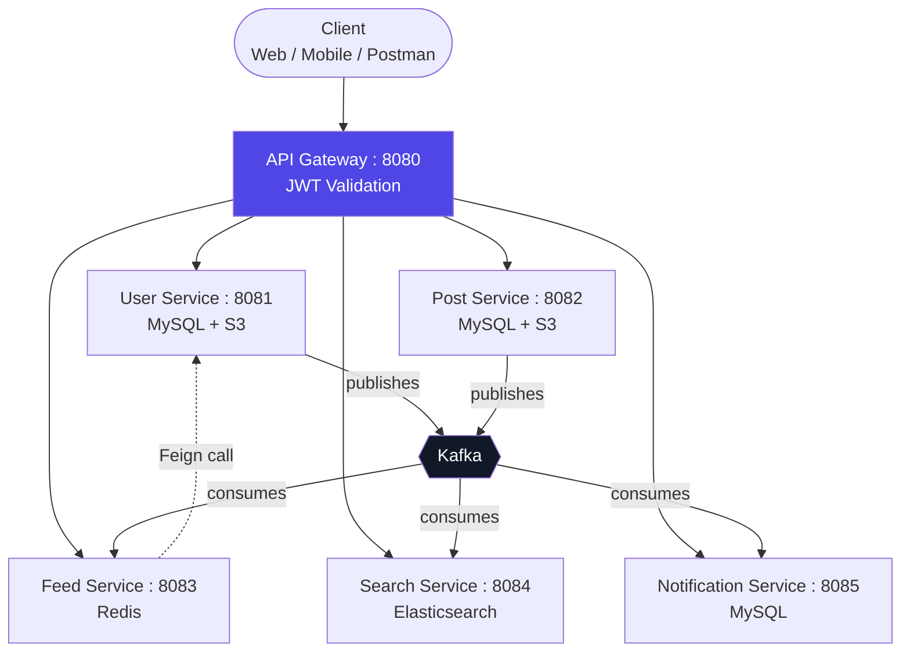
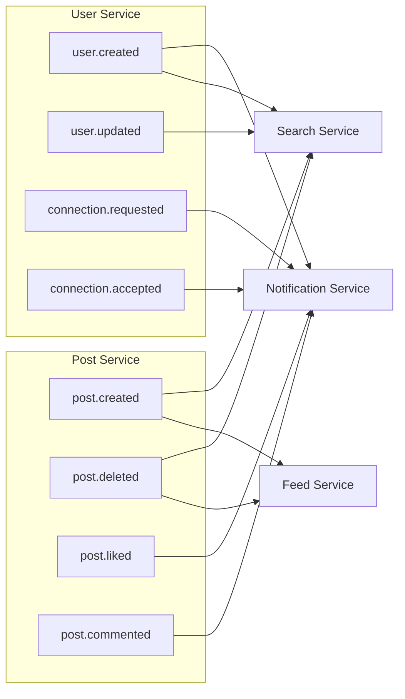
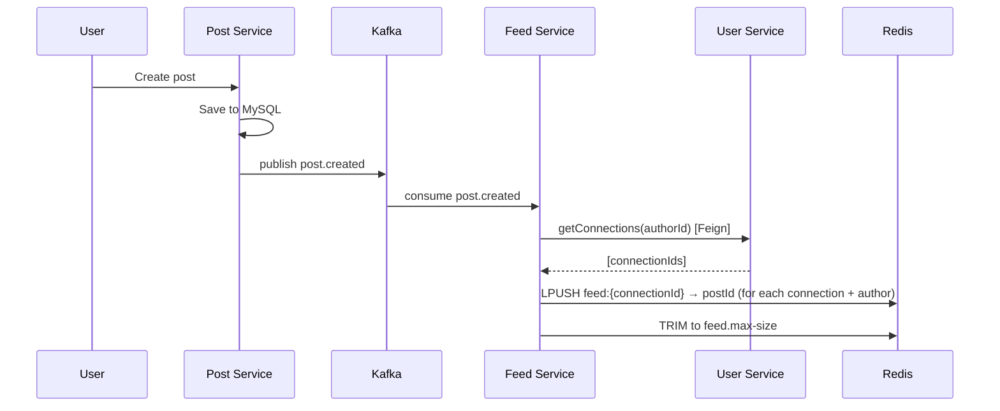
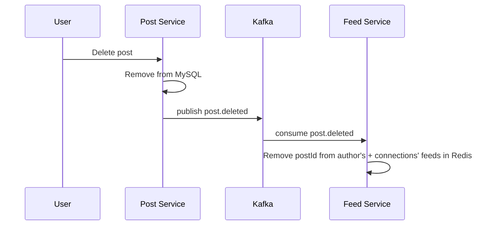
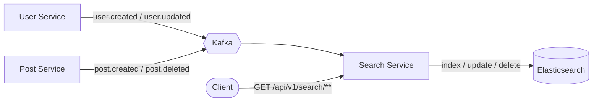

# 💼 LinkedIn System — Spring Boot Microservices

A LinkedIn-like social networking platform built from scratch using **Spring Boot Microservices**, with event-driven communication, distributed feed generation, full-text search, authentication, and media storage.

The project demonstrates how independent microservices collaborate — through an API Gateway and Kafka — to handle users, connections, posts, feeds, search, and notifications.

> 📌 This repository contains the **backend only** (6 Spring Boot services). Any client — Postman, curl, a mobile app, or a web frontend — can consume it through the API Gateway.

---

## 🏗️ Architecture



---

## ✨ Features

### 🔐 Authentication
* User registration and login
* JWT-based authentication (access + refresh tokens)
* Gateway-level JWT validation before requests reach a service
* Secure password handling with BCrypt

### 👤 User Management
* User profiles with headline, location, and skills
* Profile photo and cover photo uploads (S3)
* Connection requests, acceptance, and pending-request lookup
* View a user's connections

### 📝 Posts
* Create posts (with optional image upload)
* Like a post
* Comment on a post / list comments
* View a user's posts
* Delete a post — cascades a `post.deleted` event so it's cleaned up from feeds **and** the search index

### 📰 Feed
* Personalized, paginated user feed
* Kafka-driven fan-out-on-write feed generation
* Redis-backed feed storage for fast reads
* Manual feed-cache invalidation endpoint

### 🔎 Search
* Search people by name/keyword
* Search by skill
* Full-text, fuzzy post search
* Elasticsearch index kept in sync via Kafka (create/update/delete)

### 🔔 Notifications
* Welcome notification on signup
* Connection request / acceptance notifications
* Post like / comment notifications
* Unread count and mark-as-read endpoints

---

## 🛠️ Tech Stack

| Technology                             | Purpose                           |
| --------------------------------------- | ---------------------------------- |
| **Java 25**                             | Programming language               |
| **Spring Boot 4.1.1**                   | Microservices framework            |
| **Spring Cloud Gateway (WebFlux)**      | API Gateway + routing              |
| **Apache Kafka (KRaft mode)**           | Event-driven communication         |
| **Redis**                               | Feed storage and caching           |
| **Elasticsearch 9.4.5**                 | Full-text search                   |
| **MySQL 8**                             | Persistent data storage            |
| **AWS S3**                              | Profile/cover photo & post image storage |
| **JWT**                                 | Authentication                     |
| **OpenFeign**                           | Service-to-service communication   |
| **Docker Compose**                      | Local infrastructure setup         |

---

## 📦 Microservices

| Service                  |   Port | Data Store           | Responsibility                          |
| ------------------------ | -----: | --------------------- | ---------------------------------------- |
| **API Gateway**          | `8080` | —                      | Routing + JWT validation                 |
| **User Service**         | `8081` | MySQL + S3             | Auth, profiles, connections              |
| **Post Service**         | `8082` | MySQL + S3             | Posts, likes, comments                   |
| **Feed Service**         | `8083` | Redis                  | Personalized, paginated feeds            |
| **Search Service**       | `8084` | Elasticsearch          | People, skill, and post search           |
| **Notification Service** | `8085` | MySQL                  | Event-driven notifications               |

---

## 📡 API Reference

All routes below are exposed through the **API Gateway (`http://localhost:8080`)**. Routes other than `/api/v1/auth/**` require a valid `Authorization: Bearer <token>` header.

### Auth & Users — `user-service`
| Method | Endpoint                                              | Description                     |
| ------ | ------------------------------------------------------ | -------------------------------- |
| POST   | `/api/v1/auth/register`                                | Register a new user              |
| POST   | `/api/v1/auth/login`                                   | Log in and receive JWT tokens    |
| GET    | `/api/v1/users/{userId}`                               | Get a user's profile             |
| PUT    | `/api/v1/users/{userId}/profile`                       | Update profile details           |
| POST   | `/api/v1/users/{userId}/profile-photo`                 | Upload profile photo             |
| POST   | `/api/v1/users/{userId}/cover-photo`                   | Upload cover photo               |
| POST   | `/api/v1/users/{targetUserId}/connect`                 | Send a connection request        |
| PUT    | `/api/v1/users/connection/{connectionId}/accept`       | Accept a connection request      |
| GET    | `/api/v1/users/{userId}/connections`                   | List a user's connections        |
| GET    | `/api/v1/users/{userId}/connections/pending`           | List pending connection requests |

### Posts — `post-service`
| Method | Endpoint                              | Description               |
| ------ | -------------------------------------- | --------------------------- |
| POST   | `/api/v1/posts`                        | Create a post                |
| GET    | `/api/v1/posts/{postId}`               | Get a single post            |
| GET    | `/api/v1/posts/user/{userId}`          | Get all posts by a user      |
| POST   | `/api/v1/posts/{postId}/like`          | Like a post                  |
| POST   | `/api/v1/posts/{postId}/comment`       | Comment on a post            |
| GET    | `/api/v1/posts/{postId}/comments`      | List comments on a post      |
| DELETE | `/api/v1/posts/{postId}`               | Delete a post                |

### Feed — `feed-service`
| Method | Endpoint                          | Description                              |
| ------ | ----------------------------------- | ------------------------------------------ |
| GET    | `/api/v1/feed/{userId}?page=&size=` | Get a user's paginated feed (post IDs)     |
| DELETE | `/api/v1/feed/{userId}/cache`       | Clear a user's cached feed                 |

### Search — `search-service`
| Method | Endpoint                          | Description               |
| ------ | ----------------------------------- | --------------------------- |
| GET    | `/api/v1/search/people?q=`          | Search people by keyword    |
| GET    | `/api/v1/search/people/all`         | List all indexed people     |
| GET    | `/api/v1/search/skills?skill=`      | Search people by skill      |
| GET    | `/api/v1/search/posts?q=`           | Fuzzy full-text post search |

### Notifications — `notification-service`
| Method | Endpoint                                    | Description                    |
| ------ | --------------------------------------------- | -------------------------------- |
| GET    | `/api/v1/notifications/{userId}`              | List all notifications           |
| GET    | `/api/v1/notifications/{userId}/unread`       | List unread notifications        |
| GET    | `/api/v1/notifications/{userId}/unread/count` | Get unread notification count    |
| PUT    | `/api/v1/notifications/{notificationId}/read` | Mark a single notification read  |
| PUT    | `/api/v1/notifications/{userId}/read-all`     | Mark all notifications read      |

---

## 🔄 Event-Driven Architecture

Kafka decouples the services. Below is every event currently published and who consumes it.



> 🆕 `post.deleted` is a newer addition: deleting a post now fans out to **both** the Feed Service (removes the post ID from every affected Redis feed) and the Search Service (removes the document from the Elasticsearch index), so deleted posts don't linger anywhere.

---

## 📰 Feed Generation

The feed uses a **fan-out-on-write** approach: work happens once at post-creation time so reads stay O(1) from Redis.



Deleting a post reverses the process, removing the post ID from every feed it was pushed into:



Reads are simple and fast — `GET /api/v1/feed/{userId}` just paginates the pre-built Redis list; the client then fetches full post details from the Post Service.

---

## 🔎 Search Architecture

Search runs independently of the transactional MySQL databases, staying in sync purely through Kafka.



---

## 🐳 Infrastructure

Docker Compose spins up all required infrastructure for local development:

* **MySQL 8** — `localhost:3306`
* **Redis** — `localhost:6379`
* **Kafka (KRaft, single broker)** — `localhost:9092`
* **Elasticsearch 9.4.5** — `localhost:9200`

Start it with:

```bash
docker compose up -d
```

---

## 🚀 Running the Project

### 1. Start Infrastructure
```bash
docker compose up -d
```

### 2. Set Environment Variables
Export the variables listed below (or use a `.env` / IDE run configuration) for each service before starting it.

### 3. Start Each Service
```text
API Gateway            → 8080
User Service           → 8081
Post Service           → 8082
Feed Service           → 8083
Search Service         → 8084
Notification Service   → 8085
```
Each service is a standalone Spring Boot app — run it via `./mvnw spring-boot:run` from its own folder, or run the generated jar.

### 4. Call the API
Point any client (Postman, curl, or your own frontend) at:
```text
http://localhost:8080
```
The API Gateway is the single entry point; it validates JWTs and routes to the right service.

---

## 🔑 Environment Variables

Sensitive configuration is injected via environment variables — **never commit real secrets to GitHub.**

| Service                  | Variables |
| ------------------------- | ---------- |
| **API Gateway**           | `JWT_SECRET` |
| **User Service**          | `DB_URL`, `DB_USERNAME`, `DB_PASSWORD`, `KAFKA_BOOTSTRAP_SERVERS`, `JWT_SECRET`, `JWT_EXPIRE`, `JWT_REFRESH`, `AWS_ACCESS_KEY`, `AWS_SECRET_KEY`, `AWS_REGION`, `AWS_BUCKET_NAME` |
| **Post Service**          | `DB_URL`, `DB_USERNAME`, `DB_PASSWORD`, `KAFKA_BOOTSTRAP_SERVERS`, `AWS_ACCESS_KEY`, `AWS_SECRET_KEY`, `AWS_REGION`, `AWS_BUCKET_NAME` |
| **Feed Service**          | `KAFKA_BOOTSTRAP_SERVERS`, `USER_SERVICE_URL`, `FEED_SIZE` |
| **Search Service**        | `ELASTIC_URI`, `KAFKA_BOOTSTRAP_SERVERS` |
| **Notification Service**  | `DB_URL`, `DB_USERNAME`, `DB_PASSWORD`, `KAFKA_BOOTSTRAP_SERVERS` |

Example values:
```text
JWT_SECRET=your-secret-key
JWT_EXPIRE=3600000
JWT_REFRESH=604800000

DB_URL=jdbc:mysql://localhost:3306/your_db
DB_USERNAME=root
DB_PASSWORD=root

KAFKA_BOOTSTRAP_SERVERS=localhost:9092
ELASTIC_URI=http://localhost:9200

AWS_ACCESS_KEY=your-access-key
AWS_SECRET_KEY=your-secret-key
AWS_REGION=ap-south-1
AWS_BUCKET_NAME=your-bucket-name

USER_SERVICE_URL=http://localhost:8081
FEED_SIZE=100
```

---

## 📂 Project Structure

```text
LinkedIn-Microservices/
│
├── api-gateway/            # Routing + JWT validation (:8080)
├── user-service/           # Auth, profiles, connections (:8081)
├── post-service/           # Posts, likes, comments (:8082)
├── feed-service/           # Redis-backed personalized feed (:8083)
├── search-service/         # Elasticsearch-backed search (:8084)
├── notification-service/   # Kafka-driven notifications (:8085)
│
└── docker-compose.yml      # MySQL, Redis, Kafka, Elasticsearch
```

---

## 🎯 What I Learned

Through this project, I gained practical experience with:

* Designing a microservices architecture from scratch
* Event-driven communication using Kafka, including keeping downstream state (feeds, search index) consistent on both create **and** delete
* JWT authentication enforced at an API Gateway
* Fan-out-on-write feed generation with Redis
* Elasticsearch full-text and fuzzy search
* Service-to-service communication with OpenFeign
* AWS S3 for media storage
* Dockerized local infrastructure

---

## 📌 Project Status

**Backend completed and tested.** ✅

Authentication, user/connection management, posts, Kafka-driven feed generation and invalidation, Elasticsearch search with delete propagation, media storage, and notifications are all implemented and working end-to-end.

---

⭐ If you found this project useful, feel free to explore the code and give the repository a star.
